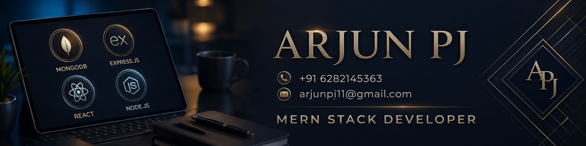

  

<h1 align="center">Hi, I'm Arjun PJ 👋</h1>

<h3 align="center">MERN Stack Developer | Building Modern Web Applications</h3>

  

---

## 👨‍💻 About Me

I am a MERN Stack Developer passionate about building clean, scalable, and user-friendly web applications.

I enjoy working with modern frontend and backend technologies, designing real-world project architectures, and creating applications that are not just functional but also production-ready.

Currently, I am developing **Imminiq**, an AI-powered interview preparation platform that creates personalized learning trackers, AI explanations, mock tests, and progress-based preparation paths.

---

## 🚀 Tech Stack

  

---

## 🧠 What I’m Focused On

- Building full-stack MERN applications
- Learning clean architecture and modular backend design
- Improving TypeScript, API design, and database architecture
- Creating production-ready project documentation
- Developing my main project: **Imminiq**

---

## 💼 Featured Project

### 🔥 Imminiq — AI-Powered Interview Prep Platform

Imminiq is a personalized interview preparation platform where users can create AI-generated learning trackers based on their field, level, goal, and timeline.

Main features include:

- AI-generated roadmap trackers
- Topic-wise explanations
- Mock tests and progress tracking
- Code compiler support for coding topics
- Community tracker sharing
- Gamification, rewards, and leaderboard system
- Admin verification and moderation system

---

## 📊 GitHub Stats

  
  

  

---

## 🐍 Contribution Graph

  

---

## 📫 Connect With Me

  
  

---

  <b>“1% better every day.”</b>

