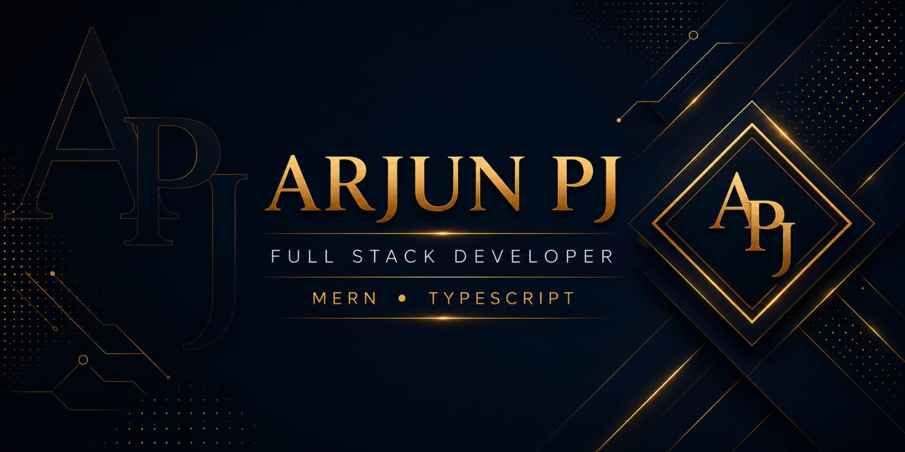

<p align="center">
  
</p>
<div align="center" >

# Arjun PJ
**MERN Stack Developer · Building Modern Web Applications**

[](https://www.linkedin.com/in/arjun-pj/)
[](https://portfolio-phi-eight-dsawdj2mf2.vercel.app/)
[](mailto:arjunpj11@gmail.com)
[](https://github.com/arjunpj-11)

</div>

---

## 👨‍💻 About Me

```txt
Location  : Kerala, India
Focus     : Full-Stack MERN Development
Currently : Building Imminiq — AI-powered interview prep platform
Learning  : Clean Architecture · TypeScript · API Design
Motto     : 1% better every day
```

---

## 🛠️ Tech Stack

| Layer | Technologies |
|---|---|
| **Frontend** | React, TypeScript, Tailwind CSS, HTML, CSS |
| **Backend** | Node.js, Express.js |
| **Database** | MongoDB |
| **Tools** | Git, GitHub, VS Code |

---

## 🔥 Featured Project — Imminiq

> AI-powered interview preparation platform with personalized learning paths

**What it does:**
- 🗺️ Generates AI roadmap trackers based on your field, level, and timeline
- 📚 Provides topic-wise AI explanations and mock tests
- 💻 Supports a built-in code compiler for coding topics
- 📊 Tracks progress with gamification and leaderboards
- 🌐 Allows community tracker sharing with admin moderation

> 🚧 Currently in active development — repo link coming soon

---

## 📈 GitHub Stats

<div align="center">
  
</div>

---

## 🐍 Contribution Activity

<div align="center">
  
</div>

---

<div align="center">
  <i>"1% better every day."</i>
</div>
