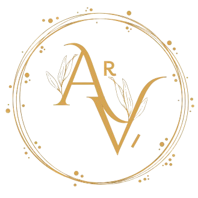

<h1>Hey  What's up?</h1>

My name is <b>Arjun PJ</b> and I'm a <b>Full-Stack Engineer</b> from  <b>India (Kerala)</b>.

---

## ✉️ Personal Letter & About Me

> *"Mathematics taught me to enjoy difficult problems. Programming gave me a place to turn that instinct into real products—and the more I understood it, the more I wanted to build."*

- ✨ Building scalable full-stack applications & real-time systems since **2024**
- 📚 Currently mastering:    
- 🎯 Operating Principle: **Ask. Understand. Improve.** — *I understand the problem before I build the solution.* 🚀
- 🎲 And ... I turn 🧮 mathematical logic into production-grade software & build AI-assisted products ⚡

---

## 🛠 I code with

  
  
  
  
  
  
  
  
  
  
  
  
  

---

## 🚀 Featured Projects

---

###  **Imminiq** — *Learning Infrastructure & AI Collaboration Platform*

<blockquote style="border-left: 4px solid #f15a35;">
  
<b>"AI starts the learning path. The community continuously improves it."</b>

</blockquote>

- **Overview & Assessment**: Imminiq is a full-stack, AI-assisted learning platform designed to replace static, fragmented learning resources with community-evolving roadmaps. AI generates initial structured learning tracks (topics, subtopics, lessons), while community discussions, verification votes, and peer contributions keep content accurate and up-to-date.
- **Architecture & Highlights**:
  - 🔄 **Background Processing**: Redis + BullMQ for asynchronous jobs and AI roadmap generation
  - ⚡ **Real-Time System**: Socket.IO & WebRTC for presence, messaging, and peer video/audio calls
  - 💻 **Code Execution & Contextual AI**: Integrated Piston execution engine & LLM context support
  - 🎯 **Quality Standards**: Clean Architecture design backed by 470+ passing automated tests
- **Tech Stack**: `React` · `TypeScript` · `Express.js` · `MongoDB` · `Redis` · `BullMQ` · `Socket.IO` · `WebRTC`

 

  
  &nbsp;
  

---

###  **ArNI** — *Full-Stack E-Commerce System*

<blockquote style="border-left: 4px solid #2563EB;">
  
<b>"Complete transaction-based product covering customer journeys, payments, fulfillment, and administration."</b>

</blockquote>

- **Overview & Assessment**: ArNI is a complete, full-stack e-commerce system built to handle end-to-end commerce logic. It integrates storefront shopping flows with an operational backend for stock, orders, returns, and sales analytics.
- **Key Features**:
  - 🛒 **Customer Workflow**: Session auth, catalog filtering, variant selection, shopping cart, multi-address checkout, wallet system, order tracking, and product return requests
  - 💳 **Payment & Security**: Integrated Razorpay payment gateway, wallet transactions, and Cash-on-Delivery logic
  - 📊 **Admin Dashboard**: Comprehensive management for stock, products, categories, coupons, banners, user accounts, and sales reporting
- **Tech Stack**: `Node.js` · `Express.js` · `MongoDB` · `EJS` · `Razorpay` · `Cloudinary`

 

  
  &nbsp;
  

---

## 🌐 Connect & Portfolio

  
  &nbsp;
  
  &nbsp;
  
  &nbsp;
  

