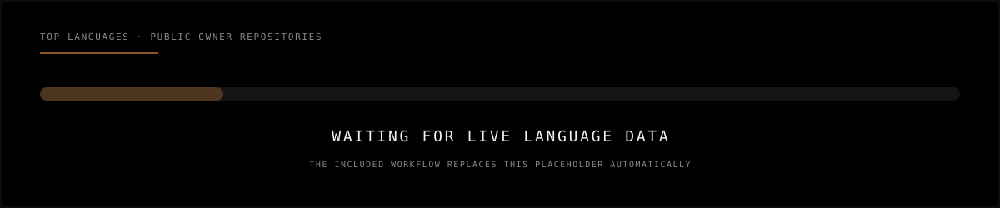

<!--
  arjunpj-11 / arjunpj-11
  GitHub Profile — dark editorial · copper accent
  Palette: #000000 · #F5F1EA · #B87333 · #8A8A8A
-->

<p align="center">
  
</p>

<p align="center">
  
</p>

<p align="center">
  <sub><code>001 · PROFILE</code> &nbsp;·&nbsp; <code>APJ</code> &nbsp;·&nbsp; <code>FULL–STACK ENGINEER</code></sub>
</p>

<br/>

### `/ 002 · ABOUT`

I'm **Arjun** — a full-stack engineer who reads the problem twice before writing the first line.
I build product systems where architecture, security, real-time communication, and business rules have to work together.
Currently building **Imminiq** in **Kerala, India**.

> *“Mathematics taught me that elegant proofs come from clear definitions — software follows the same law.”*

<br/>

### `/ 003 · CURRENT FOCUS`

```txt
▸ Building        Imminiq · structured, contextual, collaborative learning
▸ Engineering     clean architecture · queues · realtime · secure auth
▸ Maintaining     two portfolio products · Imminiq and Arni
▸ Updated         04 AUG 2026
```

<br/>

### `/ 004 · SELECTED WORK`

<table>
  <tr>
    <td width="50%" valign="top">
      <p>
        
        &nbsp;<strong>IMMINIQ</strong><br/>
        <sub><code>ACTIVE DEVELOPMENT · PRIVATE</code></sub>
      </p>
      <p>
        A community-evolving learning platform designed to make self-learning more structured, contextual, and collaborative.
      </p>
      <p>
        <strong>Product</strong><br/>
        Structured roadmaps, contextual AI support, progress insights, public tracker sharing, messaging, audio/video calls, and in-browser code execution.
      </p>
      <p>
        <strong>Engineering</strong><br/>
        Modular Clean Architecture, Redis-backed sessions, BullMQ workers, Socket.IO, WebRTC, OAuth, 2FA, refresh-token rotation, CSRF protection, and automated testing.
      </p>
      <p><sub>React · Vite · TypeScript · Express · MongoDB · Redis · BullMQ · Socket.IO · WebRTC · Piston · Turborepo · LLM APIs</sub></p>
    </td>
    <td width="50%" valign="top">
      <p>
        
        &nbsp;<strong>ARNI</strong><br/>
        <sub><code>COMPLETE · FULL-STACK PRODUCT</code></sub>
      </p>
      <p>
        My first complete full-stack product and the project that taught me how a transaction-based system fits together end to end.
      </p>
      <p>
        <strong>Product</strong><br/>
        Product discovery, cart, addresses, coupons, Razorpay payments, order tracking, cancellations, returns, wallets, inventory, and an administration workspace.
      </p>
      <p>
        <strong>Learning</strong><br/>
        How customer flows, payment state, fulfilment, business rules, inventory, and administration operate as one system—not isolated features.
      </p>
      <p><sub>Node.js · Express.js · MongoDB · EJS · Razorpay · Session Authentication · MVC</sub></p>
    </td>
  </tr>
</table>

<br/>

<p align="center">
  
</p>

<br/>

### `/ 006 · SIGNALS`

<!-- Generated locally by .github/workflows/profile-cards.yml — no public stats endpoint required. -->
<p align="center">
  
</p>

<p align="center">
  
</p>

<p align="center">
  <sub>Live cards refresh daily from public GitHub data.</sub>
</p>

<br/>

### `/ 007 · CONTRIBUTIONS`

<p align="center">
  
</p>

<br/>

### `/ 008 · HOW I WORK`

```md
  →  understand the problem before choosing the tool
  →  small commits, honest messages, reversible steps
  →  types first · tests where they earn their keep
  →  observability is not optional — logs, metrics, traces
  →  boring tech wins the boring 80% of the work
  →  write the README before writing the feature
```

<br/>

<p align="center">
  
</p>

<p align="center">
  <a href="https://github.com/arjunpj-11"><code>GITHUB</code></a>
  &nbsp;·&nbsp;
  <a href="https://www.linkedin.com/in/arjunpj-11"><code>LINKEDIN</code></a>
  &nbsp;·&nbsp;
  <a href="https://x.com/arjunpj_11"><code>X / TWITTER</code></a>
</p>

<p align="center">
  <sub><code>END · FILE 001</code></sub>
</p>
